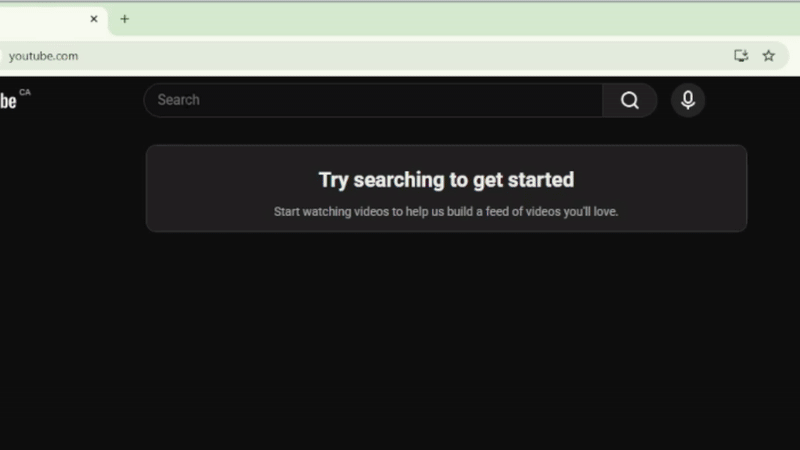

# YouTube Middle-Click

A lightweight Chrome extension that makes YouTube's search suggestions behave like real links.

## Features

- Middle-click search suggestions to open them in a new tab
- Middle-click the YouTube search button to open the current query in a new tab
- Simple popup UI to enable/disable the behavior
- GitHub link in popup for easy access to the project

## Installation (Developer Mode)

1. Clone or download this repository.
2. Open `chrome://extensions` in Chrome.
3. Enable **Developer mode** (top-right).
4. Click **Load unpacked**.
5. Select this project folder (the one containing `manifest.json`).

## Files

- `manifest.json` – Extension manifest (MV3).
- `content.js` – Logic for handling middle-clicks on suggestions / search button.
- `popup.html` / `popup.js` – Toolbar popup UI and toggle.
- `icons/128.png` – Extension icon.
- `github.svg` – Icon used inside the popup.

## License

This project is licensed under the MIT License – see the [LICENSE](LICENSE) file for details.

## Collaborators

If you’d like to contribute, feel free to jump in!

How to help:
- Open an issue if you find a bug or have an idea.
- Submit a pull request with a clear description of what you changed.
- Keep PRs small and focused when possible.
- If your change affects the UI or behavior, include a short note or screenshot/gif.

Where to make changes:
- content.js — main logic for middle-click behavior.
- popup.html / popup.js — extension popup UI.
- manifest.json — permissions and Chrome extension config.

Testing changes:
1. Go to chrome://extensions
2. Enable Developer mode
3. Click “Load unpacked” and select this project folder
4. After edits, hit “Reload” on the extension and refresh YouTube

No strict rules — keep things simple, clear, and helpful!
